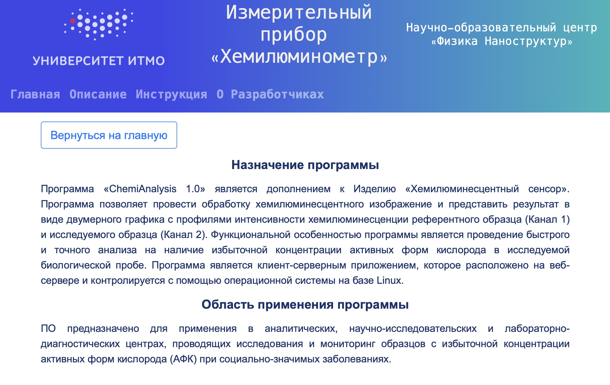
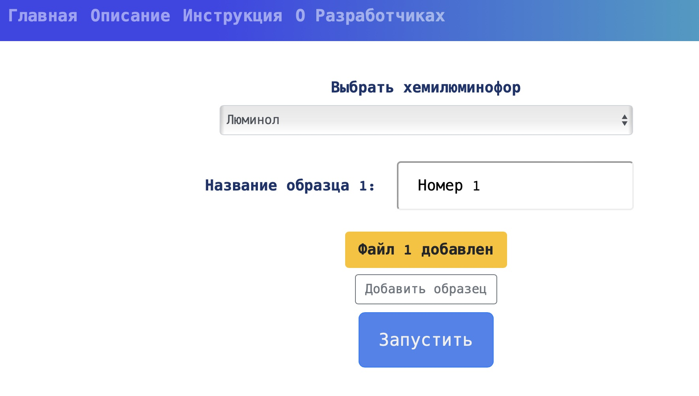
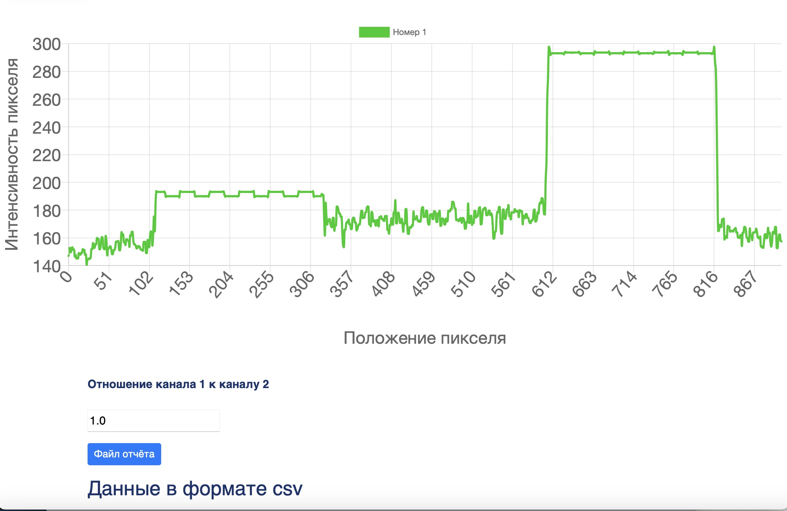
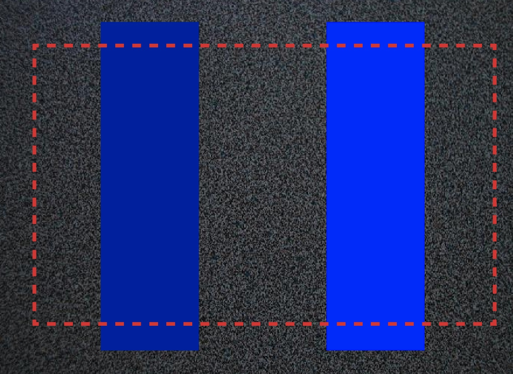

# Profile Intensity Application ChemiAnalysis 1.0

## Purpose of the program
The program **"ChemiAnalysis 1.0"** is a supplement to the Product **"Chemiluminescent Sensor"**. 
The program allows to process chemiluminescent image and present the result in the form of a two-dimensional graph with profiles of chemiluminescence intensity of the reference sample (Channel 1) and the tested sample (Channel 2). 

The functional feature of the program is a fast and accurate analysis for the presence of excessive concentration of reactive oxygen species in the biological sample under study. The program is a client-server application, which is located on a web server and controlled by a Linux-based operating system.

## Scope of the program
The software is intended for application in analytical, research and laboratory-diagnostic centers, conducting research and monitoring of samples with excessive concentration of reactive oxygen species (ROS) in socially significant diseases.

## Instructions for use
There are two modes of operation of the web application together with the sensor device: the first option is to study a single sample at once, the second option is to take a picture of several samples and work on the study with them afterwards.

At the end, a graph of the intensity profile of the samples will be shown, and a table will be given below with the answer whether the measurement samples correspond to a certain amount of substance or not

### Examination of a single sample
- From the smartphone, go to the main page of the web application and click on the "Start" button
- Prepare the device, put the smartphone in the special cradle and turn on the flow for the liquid under study
- On the smartphone, click on the "Upload file" button and select the camera
- Take a photo of the sample and upload the selected photo
- Additional samples can be added
- Press the "Run" button and wait for the page to load

Upload photo

Result

### Examine multiple samples

- Prepare the device, put the smartphone in a special cradle, start the camera and turn on the flow for the studied liquid
- Take a picture of the glowing sample
- Repeat the steps from above for a new sample
- Next, from the smartphone, go to the main page of the web application and click on the "Start" button
- On your smartphone, click on the "Upload File" button and select a photo of the first sample and give it a name.
- To add a new sample, click on the "Add Sample" button and repeat the previous step to upload the sample
- Only 5 samples can be uploaded
- Press the "Run" button and wait for the page to load.

Sample of image